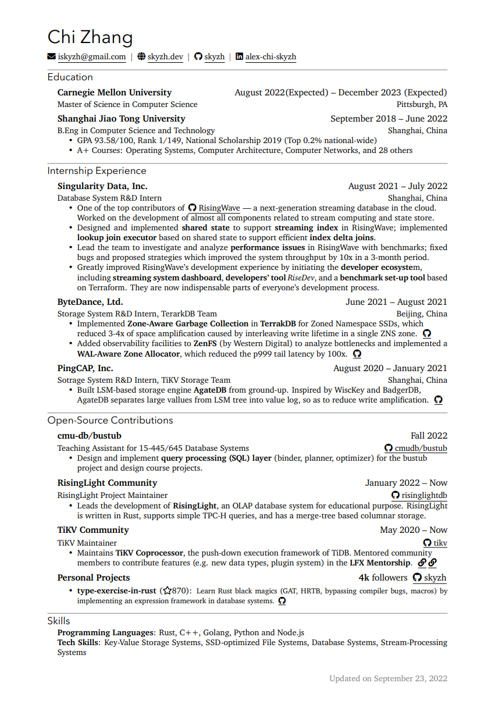

# Chi CV template

Rip-off of [Alex Chi Zhang (cxs/skyzh)](https://github.com/skyzh)'s
[CV](https://skyzh.github.io/files/cv.pdf) as a LaTeX template called `chicv`.

Suggestions and PRs are welcome. Honestly, I'm not a master in LaTeX.

照着迟先生的简历扒的模板。祝大家都能成功得令人震惊。

Note to `chi-cv-template` users: according to [Chi's twitter](https://twitter.com/iskyzh/status/1639139679235633153),
 he's planning to switch to a new typesetting app: [typst](https://typst.app/),
 which is also recommended by several of my friends.
 It's currently (as of March 2023) in beta, but it's worth a try.

## Sample Output

[PDF file](resume.pdf)

## To-Dos

### Chores

- [ ] Instructions on how to compile
- [ ] Intro to custom environments and commands
- [ ] (Probably) publish to CTAN as a proper `.cls`.

### Additional ideas

I personally need an academic curriculum vitae.

- [ ] Publication list

## Acknowledgement

Heavily referred to the code of [billryan/resume](https://github.com/billryan/resume) and [ice1000/resume](https://github.com/ice1000/resume).
